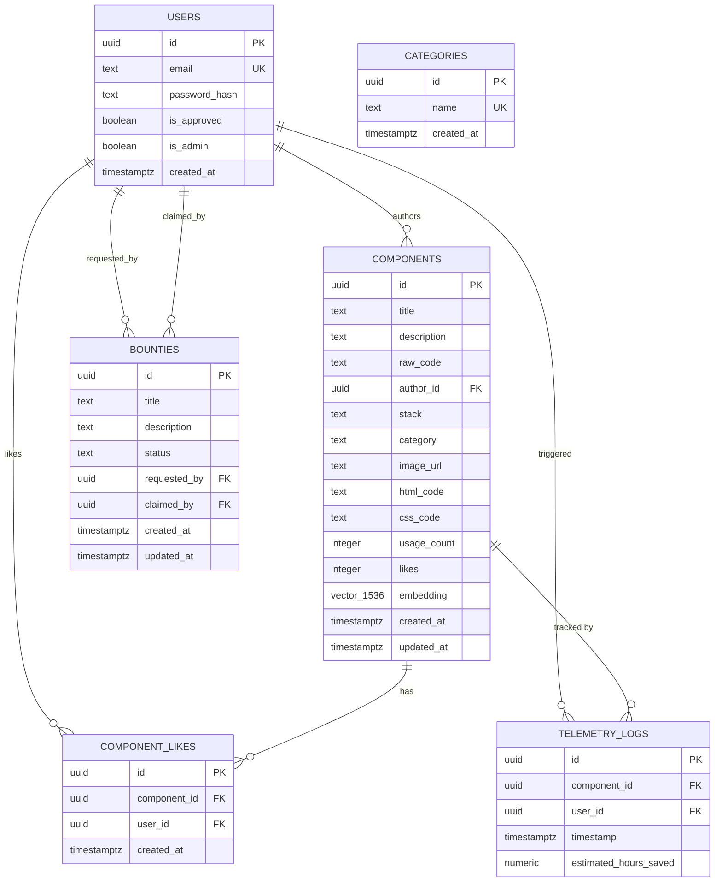

# Database Schema Reference

**Platform:** Ottobon Enterprise Component Hub  
**Database:** PostgreSQL 15+ (hosted on Supabase)  
**Extensions:** `pgvector`, `pgcrypto`  
**Last Updated:** 2026-03-06  

---

## 1. Entity-Relationship Diagram



---

## 2. Table Definitions

### `users`

Custom authentication table. Managed by the API — **not** Supabase Auth.

| Column | Type | Nullable | Default | Description |
|--------|------|:--------:|---------|-------------|
| `id` | `UUID` | ✗ | `gen_random_uuid()` | Primary key |
| `email` | `TEXT` | ✗ | — | Unique user identifier |
| `password_hash` | `TEXT` | ✗ | — | bcrypt hash (cost factor 12) |
| `is_approved` | `BOOLEAN` | ✗ | `false` | Admin must set `true` before user can log in |
| `is_admin` | `BOOLEAN` | ✗ | `false` | Can approve other users and create categories |
| `created_at` | `TIMESTAMPTZ` | ✗ | `NOW()` | Account creation timestamp |

> [!IMPORTANT]
> New registrations default to `is_approved = false`. The account is locked out until an admin manually approves it via the Supabase table editor or an admin API route.

---

### `components`

Core registry of all shared UI components.

| Column | Type | Nullable | Default | Description |
|--------|------|:--------:|---------|-------------|
| `id` | `UUID` | ✗ | `gen_random_uuid()` | Primary key |
| `title` | `TEXT` | ✗ | — | Human-readable component name |
| `description` | `TEXT` | ✗ | — | Used as the input for OpenAI embedding generation |
| `raw_code` | `TEXT` | ✗ | — | Full TypeScript/React source — no size limit |
| `html_code` | `TEXT` | ✓ | `NULL` | HTML portion (for components using separate HTML) |
| `css_code` | `TEXT` | ✓ | `NULL` | CSS portion (for components using separate CSS) |
| `author_id` | `UUID` | ✗ | — | FK → `users.id` |
| `stack` | `TEXT` | ✓ | `NULL` | Technology identifier (e.g. `vite-react-ts`) |
| `category` | `TEXT` | ✓ | `NULL` | Freeform category tag (e.g. `forms`, `navigation`) |
| `image_url` | `TEXT` | ✓ | `NULL` | Supabase Storage public URL for component screenshot |
| `usage_count` | `INTEGER` | ✗ | `0` | Incremented on each `hub add` CLI invocation |
| `likes` | `INTEGER` | ✗ | `0` | Aggregate like count (de-normalised for performance) |
| `embedding` | `VECTOR(1536)` | ✓ | `NULL` | OpenAI `text-embedding-ada-002` output |
| `created_at` | `TIMESTAMPTZ` | ✗ | `NOW()` | — |
| `updated_at` | `TIMESTAMPTZ` | ✗ | `NOW()` | Auto-updated via trigger |

**Indexes:**

```sql
-- HNSW index for sub-millisecond cosine similarity search
CREATE INDEX components_embedding_idx
  ON components USING hnsw (embedding vector_cosine_ops)
  WITH (m = 16, ef_construction = 64);
```

**Triggers:**
- `components_updated_at` — fires `BEFORE UPDATE`, sets `updated_at = NOW()`

---

### `component_likes`

Junction table preventing duplicate likes (one like per user per component).

| Column | Type | Nullable | Default | Description |
|--------|------|:--------:|---------|-------------|
| `id` | `UUID` | ✗ | `gen_random_uuid()` | Primary key |
| `component_id` | `UUID` | ✗ | — | FK → `components.id` ON DELETE CASCADE |
| `user_id` | `UUID` | ✗ | — | FK → `users.id` |
| `created_at` | `TIMESTAMPTZ` | ✗ | `NOW()` | — |

> [!NOTE]
> A `UNIQUE(component_id, user_id)` constraint prevents double-liking. The API must also decrement `components.likes` when a like row is deleted (toggle behaviour).

---

### `categories`

Controlled vocabulary of component categories.

| Column | Type | Nullable | Default | Description |
|--------|------|:--------:|---------|-------------|
| `id` | `UUID` | ✗ | `gen_random_uuid()` | Primary key |
| `name` | `TEXT` | ✗ | — | Unique category name (e.g. `forms`, `overlays`) |
| `created_at` | `TIMESTAMPTZ` | ✗ | `NOW()` | — |

---

### `bounties`

Gamified component request board.

| Column | Type | Nullable | Default | Description |
|--------|------|:--------:|---------|-------------|
| `id` | `UUID` | ✗ | `gen_random_uuid()` | Primary key |
| `title` | `TEXT` | ✗ | — | Short description of what is needed |
| `description` | `TEXT` | ✗ | — | Full specification of the component request |
| `status` | `TEXT` | ✗ | `'requested'` | Enum: `requested \| in-progress \| completed` |
| `requested_by` | `UUID` | ✗ | — | FK → `users.id` |
| `claimed_by` | `UUID` | ✓ | `NULL` | FK → `users.id` — null until someone picks it up |
| `created_at` | `TIMESTAMPTZ` | ✗ | `NOW()` | — |
| `updated_at` | `TIMESTAMPTZ` | ✗ | `NOW()` | Auto-updated via trigger |

**Status lifecycle:**
```
requested → in-progress → completed
```

---

### `telemetry_logs`

Immutable audit log of every CLI component injection. Drives the Analytics dashboard.

| Column | Type | Nullable | Default | Description |
|--------|------|:--------:|---------|-------------|
| `id` | `UUID` | ✗ | `gen_random_uuid()` | Primary key |
| `component_id` | `UUID` | ✗ | — | FK → `components.id` ON DELETE CASCADE |
| `user_id` | `UUID` | ✗ | — | Developer who ran `hub add` |
| `timestamp` | `TIMESTAMPTZ` | ✗ | `NOW()` | When the injection occurred |
| `estimated_hours_saved` | `NUMERIC(5,2)` | ✗ | `0.00` | Business ROI metric — set per component |

**Indexes:**
```sql
CREATE INDEX telemetry_component_idx ON telemetry_logs (component_id);
CREATE INDEX telemetry_user_idx      ON telemetry_logs (user_id);
```

> [!NOTE]
> `telemetry_logs` rows must **never be updated or deleted** by application code. They are an immutable ledger. Only `ON DELETE CASCADE` from `components` may remove rows.

---

## 3. PostgreSQL Functions & RPC

### `match_components(query_embedding, match_count)`

The semantic search engine. Called directly from `apps/api/src/routes/components/search.ts`.

```sql
CREATE OR REPLACE FUNCTION match_components(
  query_embedding vector(1536),
  match_count     int DEFAULT 5
)
RETURNS TABLE (
  id          uuid,
  title       text,
  description text,
  author_id   uuid,
  usage_count int,
  likes       int,
  created_at  timestamptz,
  similarity  float
)
LANGUAGE plpgsql AS $$
BEGIN
  RETURN QUERY
  SELECT
    c.id, c.title, c.description, c.author_id,
    c.usage_count, c.likes, c.created_at,
    1 - (c.embedding <=> query_embedding) AS similarity
  FROM components c
  WHERE c.embedding IS NOT NULL
  ORDER BY c.embedding <=> query_embedding
  LIMIT match_count;
END;
$$;
```

**Key behaviour:**
- Uses the `<=>` cosine distance operator from `pgvector`
- Similarity = `1 - distance` → closer to 1.0 = more semantically similar
- Only considers components where `embedding IS NOT NULL`
- HNSW index on `(embedding vector_cosine_ops)` makes this ~sub-millisecond even at scale

---

## 4. Row Level Security (RLS)

RLS is **enabled** on `components`, `bounties`, and `telemetry_logs`. The API uses Supabase's **service role key** (bypasses RLS) for all server-side operations.

| Table | RLS Enabled | Policy Strategy |
|-------|:-----------:|-----------------|
| `users` | ✗ | Managed entirely by API — no direct client access |
| `components` | ✓ | Service role bypasses; future: user-scoped read policies |
| `bounties` | ✓ | Service role bypasses; future: creator-only write |
| `telemetry_logs` | ✓ | Service role insert only; no client reads |
| `component_likes` | ✗ | Managed by API — no direct client access |
| `categories` | ✗ | Public read via API |

> [!CAUTION]
> Never expose the Supabase `service_role` key to the browser or to `apps/web`. It must only live in `apps/api/.env` as `SUPABASE_SERVICE_KEY`.

---

## 5. Migration History

| File | Purpose | Applied |
|------|---------|:-------:|
| `schema.sql` | Initial schema: users, components, bounties, telemetry_logs, pgvector | ✓ |
| `migrate-categories-table.js` | Added `categories` table | ✓ |
| `migrate-category.js` | Added `category` column to `components` | ✓ |
| `migrate-stack.js` | Added `stack` column to `components` | ✓ |
| `migrate-likes.js` | Added `component_likes` table + `likes` column | ✓ |
| `migrate-user-name.js` | Added name fields to `users` | ✓ |
| `migrate-image-url.js` | Added `image_url` column to `components` | ✓ |

All migration scripts live in `scripts/database/migrations/` and use the same `pg.Pool` + `DATABASE_URL` pattern as the API.
