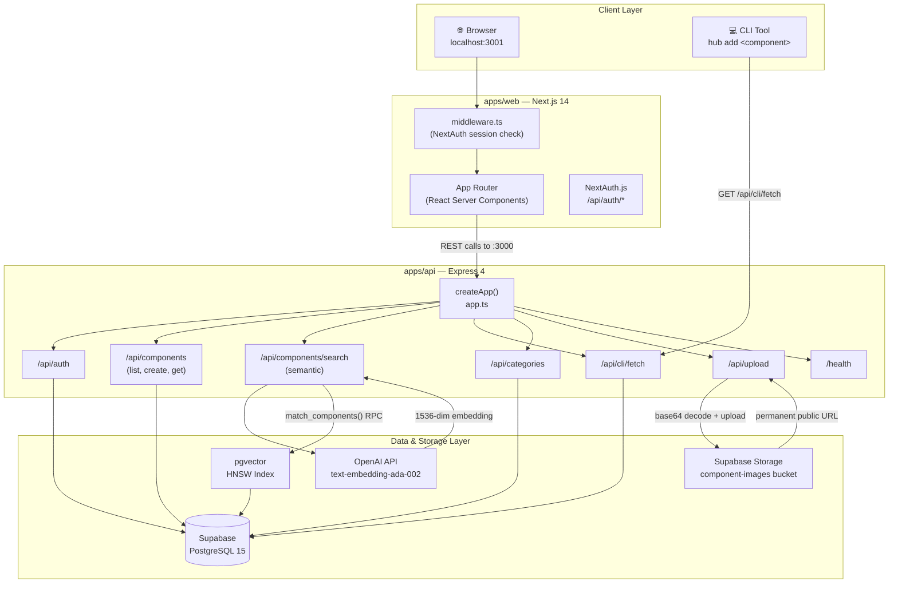
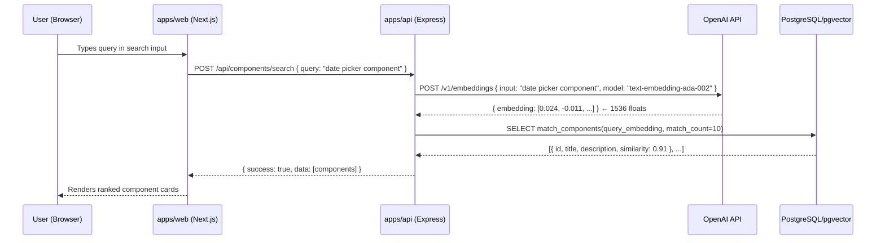
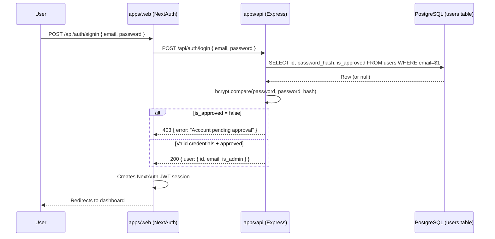
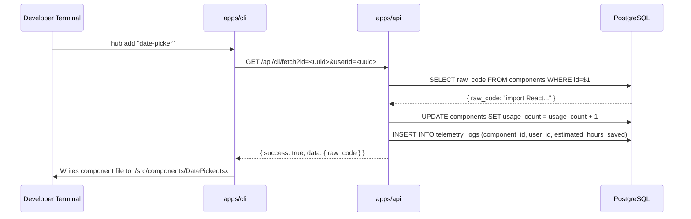

# System Architecture Document

**Platform:** Ottobon Enterprise Component Hub  
**Version:** 1.0  
**Last Updated:** 2026-03-06  
**Owner:** Platform Engineering  

---

## 1. Overview

The Enterprise Component Hub is a **full-stack internal developer platform** designed to centralise, discover, and inject reusable React/TypeScript UI components across an organisation's engineering teams.

It consists of three distinct runtime processes:

| Process | Runtime | Port | Purpose |
|---------|---------|------|---------|
| `apps/api` | Node.js 20 / Express 4 | 3000 | REST API, semantic search, auth, telemetry |
| `apps/web` | Next.js 14 (App Router) | 3001 | Browser UI — component browser, analytics |
| `apps/cli` | Node.js 20 | N/A | Terminal tool: `hub add <component>` |

All three processes share a single **Supabase (PostgreSQL 15 + pgvector)** backend.

---

## 2. Tech Stack

| Layer | Technology | Version | Rationale |
|-------|-----------|---------|-----------|
| **Frontend Framework** | Next.js (App Router) | 14.x | React Server Components, built-in routing, Vercel-ready |
| **API Framework** | Express | 4.18 | Minimal, battle-tested, easy to reason about |
| **Language** | TypeScript | 5.6 | Strict typing enforced across all apps |
| **Database** | PostgreSQL (Supabase) | 15+ | Native `pgvector` extension for AI embeddings |
| **DB Access** | `pg` (node-postgres) | 8.x | Raw SQL via typed pool wrapper — no ORM overhead |
| **Vector Index** | pgvector HNSW | — | Cosine similarity search on 1536-dim OpenAI embeddings |
| **AI Embeddings** | OpenAI `text-embedding-ada-002` | — | Component semantic understanding |
| **Auth** | NextAuth.js (Credentials) | 5.x | Custom approval-gated user table, bcrypt passwords |
| **File Storage** | Supabase Storage | — | Permanent public URLs for component screenshots |
| **Runtime Env** | dotenv | — | `.env` file per app |
| **Dev Server** | nodemon + ts-node | — | Zero-build dev loop for API |
| **Process Manager** | SIGTERM / SIGINT handlers | — | 10s graceful shutdown before forced exit |

---

## 3. Component Architecture Diagram

---

## 4. API Route Reference

| Method | Route | Auth Required | Description |
|--------|-------|:---:|-------------|
| `GET` | `/health` | ✗ | Liveness probe — returns `{ status: "ok", timestamp }` |
| `POST` | `/api/auth/login` | ✗ | Credentials login — validates email/bcrypt hash, returns session |
| `POST` | `/api/auth/register` | ✗ | Creates user with `is_approved: false` — access pending admin approval |
| `GET` | `/api/components` | ✓ | List all components with optional `?category=` and `?search=` filters |
| `POST` | `/api/components` | ✓ | Create component — triggers OpenAI embedding generation |
| `GET` | `/api/components/:id` | ✓ | Fetch single component with full `raw_code` |
| `POST` | `/api/components/search` | ✓ | Natural-language semantic search via pgvector cosine similarity |
| `GET` | `/api/categories` | ✓ | List all component categories |
| `POST` | `/api/categories` | ✓ (Admin) | Create new category |
| `GET` | `/api/cli/fetch` | Token | CLI code injection — increments `usage_count`, logs telemetry |
| `POST` | `/api/upload` | ✓ | Upload component screenshot (base64 → Supabase Storage) |

---

## 5. Semantic Search Data Flow

---

## 6. Authentication Flow

---

## 7. CLI Injection Flow

---

## 8. Key Design Decisions

### No ORM — Raw SQL via `pg.Pool`

> The API uses a typed `query<T>()` wrapper around `pg.Pool` instead of an ORM (e.g. Prisma, Drizzle).

**Why:** The SQL queries in this platform are non-trivial — vector similarity RPCs, JSONB aggregations, analytics rollups. An ORM abstraction would obscure the actual query plan and degrade maintainability. All queries use `$1`-style parameterization to prevent SQL injection.

### Approval-Gated Auth

> Users who register are set to `is_approved: false` by default. An admin must manually flip this flag.

**Why:** This is an internal enterprise tool, not a public SaaS. Controlled access prevents credential abuse.

### base64 Image Upload (no Multer)

> Images are POSTed as base64-encoded strings in JSON body, decoded to `Buffer` server-side, and pushed to Supabase Storage.

**Why:** Multer (multipart/form-data) introduced TypeScript declaration conflicts with `ts-node`. The base64-JSON approach has zero external dependencies and produces permanent CDN-backed URLs.

### pgvector HNSW Index

> Components are indexed using Hierarchical Navigable Small World (HNSW) with `m=16`, `ef_construction=64`.

**Why:** HNSW provides sub-millisecond approximate nearest-neighbour lookup at scale, far outperforming exact IVFFlat for real-time search UX. Cosine distance (`vector_cosine_ops`) is the correct metric for normalised OpenAI embeddings.
