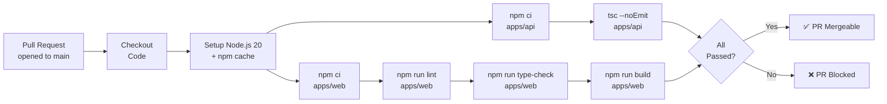

# CI/CD Pipeline

**Platform:** Ottobon Enterprise Component Hub  
**Pipeline Tool:** GitHub Actions  
**Config:** `.github/workflows/ci.yml`  
**Last Updated:** 2026-03-06  

---

## 1. Pipeline Overview



**Trigger:** Every Pull Request targeting the `main` branch.  
**Runner:** `ubuntu-latest` (GitHub-hosted)

---

## 2. Current Workflow — `ci.yml`

```yaml
name: Component Hub CI/CD

on:
  pull_request:
    branches: [ main ]

jobs:
  quality-control:
    name: Lint, Type Check, and Build
    runs-on: ubuntu-latest

    steps:
      - name: Checkout Code
        uses: actions/checkout@v4

      - name: Setup Node.js
        uses: actions/setup-node@v4
        with:
          node-version: '20'
          cache: 'npm'

      - name: Install Root Dependencies
        run: npm ci

      - name: Install Frontend Dependencies
        working-directory: ./apps/web        # ← Updated from ./frontend post-restructure
        run: npm ci

      - name: Frontend Strict Linting
        working-directory: ./apps/web
        run: npm run lint

      - name: Frontend Type Check
        working-directory: ./apps/web
        run: npm run type-check

      - name: Frontend Build Verification
        working-directory: ./apps/web
        run: npm run build
```

> [!WARNING]
> The current `ci.yml` still references `./frontend` (pre-monorepo-restructure path). **Update all `working-directory` references** from `./frontend` to `./apps/web` to fix the pipeline after the restructure.

---

## 3. What Each Step Does

| Step | Command | Why It Matters |
|------|---------|---------------|
| **Checkout Code** | `actions/checkout@v4` | Clones the PR branch into the runner |
| **Setup Node.js** | `actions/setup-node@v4` | Pins Node 20, enables npm cache to speed up installs |
| **Install Root Dependencies** | `npm ci` | Installs root orchestrator package (if any) |
| **Install Frontend Dependencies** | `npm ci` in `apps/web` | Clean install of all Next.js dependencies |
| **Strict Linting** | `npm run lint` | ESLint enforces code style — fails on any warning |
| **Type Check** | `npm run type-check` (`tsc --noEmit`) | Validates all TypeScript across the entire frontend |
| **Build Verification** | `npm run build` | Next.js production build confirms no runtime errors at compile time |

---

## 4. Environment Variables in CI

The current pipeline does not require secrets (it only lints and builds the frontend). When a deployment job is added, the following must be configured in **GitHub → Settings → Secrets and Variables → Actions**:

| Secret Name | Used By | Source |
|-------------|---------|--------|
| `DATABASE_URL` | `apps/api` deploy | Supabase → Settings → Database → Connection String |
| `OPENAI_API_KEY` | `apps/api` deploy | OpenAI Dashboard |
| `SUPABASE_URL` | `apps/api` deploy | Supabase → Settings → API |
| `SUPABASE_SERVICE_KEY` | `apps/api` deploy | Supabase → Settings → API → Secret Keys |
| `NEXT_PUBLIC_API_URL` | `apps/web` deploy | Production API URL |
| `NEXTAUTH_URL` | `apps/web` deploy | Production frontend URL |
| `NEXTAUTH_SECRET` | `apps/web` deploy | 32+ char random string |

> [!CAUTION]
> Never put secrets in the `ci.yml` file directly. Always use `${{ secrets.SECRET_NAME }}` syntax.

---

## 5. Recommended Pipeline Extensions

### Add API Type-Check Job

```yaml
  api-type-check:
    name: API Type Check
    runs-on: ubuntu-latest
    steps:
      - uses: actions/checkout@v4
      - uses: actions/setup-node@v4
        with:
          node-version: '20'
          cache: 'npm'
      - name: Install API Dependencies
        working-directory: ./apps/api
        run: npm ci
      - name: API Type Check
        working-directory: ./apps/api
        run: npm run type-check
```

### Add Test Job (when tests are written)

```yaml
  test:
    name: Run Tests
    runs-on: ubuntu-latest
    needs: [quality-control, api-type-check]
    steps:
      - uses: actions/checkout@v4
      - uses: actions/setup-node@v4
        with:
          node-version: '20'
      - working-directory: ./apps/api
        run: npm ci && npm test
```

---

## 6. Branch Protection Rules (Recommended)

Configure in **GitHub → Settings → Branches → Branch Protection Rules for `main`**:

- ✅ Require pull request reviews (minimum 1 approver)
- ✅ Require status checks to pass before merging (`quality-control`)
- ✅ Require branches to be up to date before merging
- ✅ Restrict direct pushes to `main`
- ✅ Do not allow bypassing the above settings
