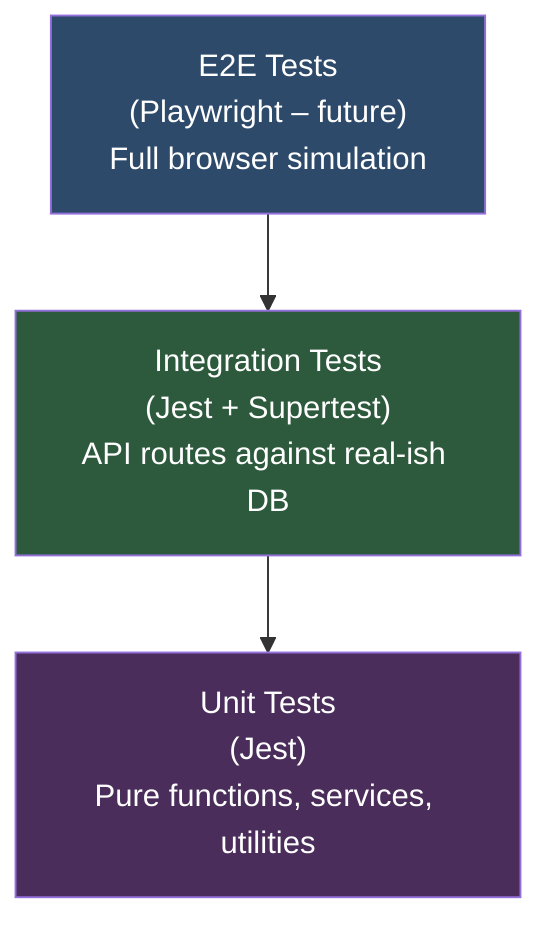

# Testing Strategy

**Platform:** Ottobon Enterprise Component Hub  
**Test Runner:** Jest (API) + React Testing Library (Web)  
**Last Updated:** 2026-03-06  

---

## 1. Testing Philosophy

> **Test behaviour, not implementation.** A test that breaks when you rename a variable is not a useful test. A test that breaks when a user can no longer log in is.

Tests exist to catch regressions at the boundaries that matter:

1. **API route logic** — does the endpoint return the right status codes and response shapes?
2. **Database interactions** — do queries round-trip correctly?
3. **Frontend rendering** — do components render correctly under different data states?
4. **Auth guards** — are protected routes actually protected?

---

## 2. Test Layers



| Layer | Tooling | Location | Run Command |
|-------|---------|----------|-------------|
| Unit | Jest | `apps/api/tests/unit/` | `npm test` |
| Integration | Jest + Supertest | `apps/api/tests/integration/` | `npm test` |
| E2E | Playwright (planned) | `apps/web/tests/e2e/` | `npx playwright test` |

---

## 3. API Unit Tests

### What to Test

- **Service functions**: `embeddingService.ts` — mock the OpenAI client, verify the embedding vector is stored correctly
- **Utility functions** in `src/lib/` — pure functions with deterministic input/output
- **Zod schemas** — verify valid payloads pass, invalid ones fail with the right error shape

### Example — Embedding Service Unit Test

```typescript
// apps/api/tests/unit/embeddingService.test.ts
import { generateEmbedding } from '../../src/services/embeddingService';

jest.mock('openai', () => ({
    OpenAI: jest.fn().mockImplementation(() => ({
        embeddings: {
            create: jest.fn().mockResolvedValue({
                data: [{ embedding: new Array(1536).fill(0.1) }],
            }),
        },
    })),
}));

describe('generateEmbedding', () => {
    it('returns a 1536-dimensional vector', async () => {
        const embedding = await generateEmbedding('A responsive date picker component');
        expect(embedding).toHaveLength(1536);
        expect(typeof embedding[0]).toBe('number');
    });

    it('throws if OpenAI API fails', async () => {
        // Override mock to reject
        jest.spyOn(require('openai').OpenAI.prototype.embeddings, 'create')
            .mockRejectedValueOnce(new Error('rate limit'));
        await expect(generateEmbedding('test')).rejects.toThrow('rate limit');
    });
});
```

---

## 4. API Integration Tests

### Setup Strategy

Integration tests use the **real database** (test schema on Supabase) or a local PostgreSQL instance. The test suite:
1. Imports `createApp()` from `app.ts` without binding a port
2. Uses Supertest to make HTTP requests directly to the Express app
3. Seeds required data before each test, cleans up after

```typescript
// apps/api/tests/integration/components.test.ts
import request from 'supertest';
import { createApp } from '../../src/app';

const app = createApp();

describe('GET /api/components', () => {
    it('returns 200 with success envelope', async () => {
        const res = await request(app).get('/api/components');
        expect(res.status).toBe(200);
        expect(res.body.success).toBe(true);
        expect(Array.isArray(res.body.data)).toBe(true);
    });
});

describe('POST /api/components', () => {
    it('returns 400 if title is missing', async () => {
        const res = await request(app)
            .post('/api/components')
            .send({ description: 'test', raw_code: 'const x = 1' });
        expect(res.status).toBe(400);
        expect(res.body.success).toBe(false);
    });
});
```

### Auth Integration Tests

```typescript
describe('POST /api/auth/login', () => {
    it('returns 401 for invalid credentials', async () => {
        const res = await request(app)
            .post('/api/auth/login')
            .send({ email: 'nobody@example.com', password: 'wrong' });
        expect(res.status).toBe(401);
    });

    it('returns 403 if account is not approved', async () => {
        // Assumes test DB has a user with is_approved=false
        const res = await request(app)
            .post('/api/auth/login')
            .send({ email: 'pending@test.com', password: 'Test1234!' });
        expect(res.status).toBe(403);
        expect(res.body.error).toMatch(/pending approval/i);
    });
});
```

---

## 5. Frontend Component Tests

### What to Test

- Component renders without crashing under expected props
- Conditional rendering (e.g. `ComponentCard` shows image if `image_url` is present, shows SVG placeholder if not)
- Form validation messages appear correctly in `NewComponentModal`

### Example — ComponentCard Rendering

```typescript
// apps/web/src/components/__tests__/ComponentCard.test.tsx
import { render, screen } from '@testing-library/react';
import { ComponentCard } from '../ComponentCard';

const baseComponent = {
    id: 'abc-123',
    title: 'Date Picker',
    description: 'A reusable date picker',
    category: 'forms',
    likes: 12,
    usage_count: 34,
};

it('renders title and description', () => {
    render(<ComponentCard component={baseComponent} />);
    expect(screen.getByText('Date Picker')).toBeInTheDocument();
});

it('renders image when image_url is provided', () => {
    const withImage = { ...baseComponent, image_url: 'https://example.com/img.png' };
    render(<ComponentCard component={withImage} />);
    const img = screen.getByRole('img');
    expect(img).toHaveAttribute('src', 'https://example.com/img.png');
});

it('renders SVG placeholder when no image_url', () => {
    render(<ComponentCard component={baseComponent} />);
    expect(screen.queryByRole('img')).toBeNull();
    // Verify SVG placeholder is shown
});
```

---

## 6. Edge Cases to Cover

| Scenario | Expected Behaviour | Test Location |
|----------|-------------------|---------------|
| Component with no embedding is searched | Excluded from results; no crash | Integration |
| `image_url` is `null` in DB | `ComponentCard` renders SVG placeholder | Unit (Frontend) |
| User registers but not approved, tries to navigate to `/` | Redirected to `/pending-approval` | Integration / E2E |
| OpenAI API returns error during component creation | Component still created, `embedding` set to `null` | Integration |
| Upload file exceeds 5MB | API returns `400` with size error | Integration |
| Unsupported MIME type uploaded | API returns `400` with type error | Integration |
| CLI fetch with invalid component ID | API returns `404` | Integration |
| `match_components()` called with 0 components in DB | Returns empty array; no crash | Integration |
| Concurrent likes from same user | `UNIQUE(component_id, user_id)` prevents duplicate | Integration |
| `SIGTERM` signal sent to API process | 10s graceful shutdown, in-flight requests complete | Manual / smoke |

---

## 7. Known Limitations & Technical Debt

| Item | Impact | Severity | Recommended Fix |
|------|--------|:--------:|----------------|
| No embedding backfill for existing components | Semantic search misses pre-AI components | Medium | Write `scripts/database/admin/backfill-embeddings.js` |
| CI pipeline points to `./frontend` (stale path) | CI fails after monorepo restructure | **High** | Update `ci.yml` to use `./apps/web` |
| `ci.yml` does not test `apps/api` | API TypeScript errors reach `main` undetected | **High** | Add `api-type-check` job to CI |
| No E2E test coverage | Regressions in browser flows go undetected | Medium | Introduce Playwright for auth + component creation flows |
| `likes` column is de-normalised | `components.likes` can drift from actual `component_likes` count | Low | Add a reconciliation cron or computed column |
| Migration scripts are not idempotent | Running a migration twice can error/corrupt | Medium | Add `IF NOT EXISTS` / `IF EXISTS` guards to all migrations |
| `public/uploads/` directory still present in `apps/api` | Legacy local storage artefact, no longer used | Low | Remove after confirming all images are in Supabase Storage |
